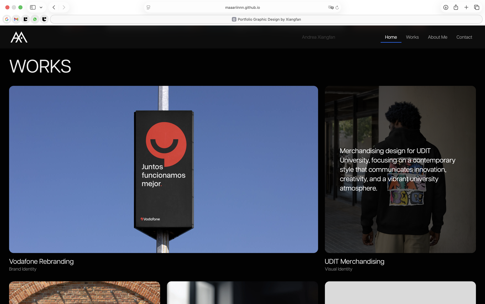
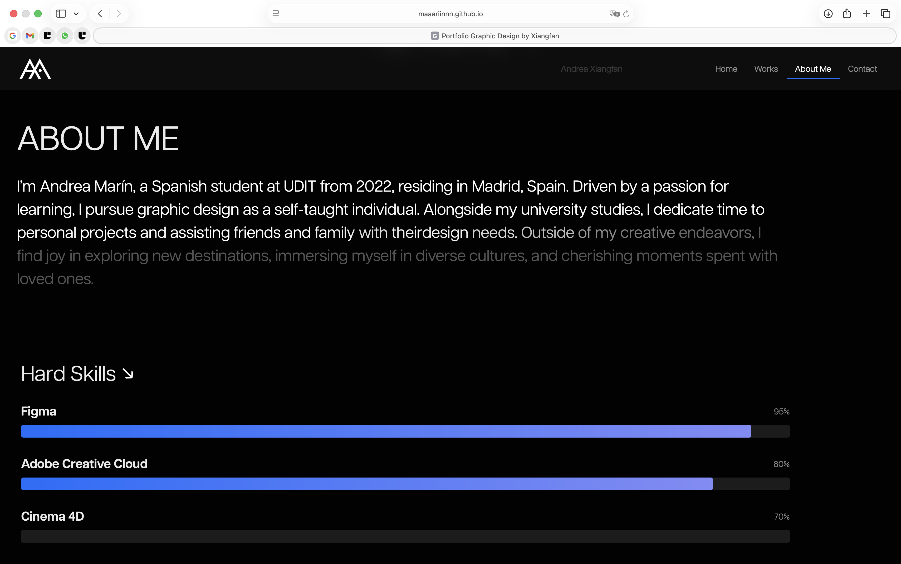
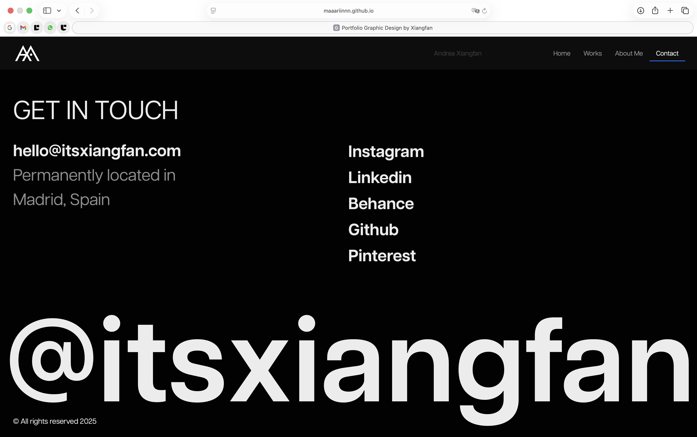
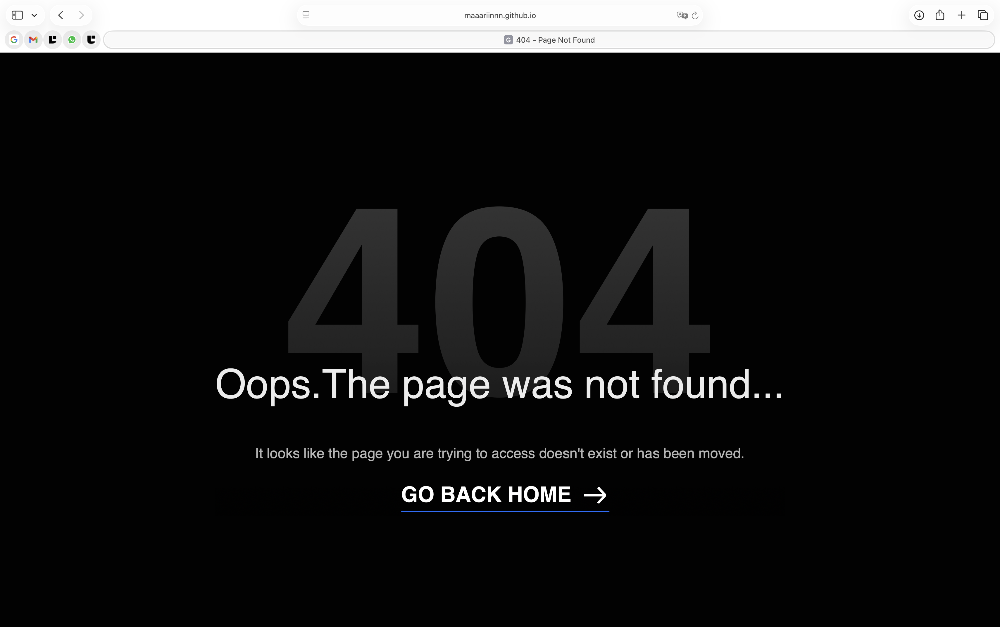

# bIENVENIDE A MI PORTFOLIO!

> Aquí puedes encontrar mi sitio en vivo! : [https://maaariinnn.github.io/Personal-portfolio-template/] (https://maaariinnn.github.io/Personal-portfolio-template/)

<!-- ----------->

DESCRIPCIÓN DEL PROYECTO

Portfolio web personal orientado a la presentación de proyectos de diseño gráfico y multimedia.
El diseño prioriza la claridad visual, el ritmo editorial y una estructura simétrica inspirada en portfolios de autor.

<!-- ----------->

TECNOLOGÍAS UTILIZADAS

- HTML5
- CSS3 (Grid y Flexbox)
- Boostrap
- JavaScript
- GSAP (animaciones y parallax suave)

<!-- ----------->

DECISIONES DE DISEÑO

- Layout de 12 columnas para generar ritmo visual en desktop y tablet; en móvil los proyectos ocupan el ancho completo.
- Jerarquía tipográfica basada en grandes titulares y espacios en blanco.
- Footer con elemento tipográfico a escala del viewport para reforzar la identidad del autor.
- Responsividad mediante unidades relativas y CSS Grid.

INSTRUCCIONES DE CONFIGURACIÓN PARA DESARROLLO LOCAL

1. Clonar el repositorio:
   git clone https://github.com/maaariinnn/Personal-portfolio-template.git
2. Abrir index.html en tu navegador.
3. Para cambios en CSS o JS, editar los archivos correspondientes dentro de las carpetas css/ y js/.

<!------------->

GUÍA DE PERSONALIZACIÓN

- Agregar nuevos proyectos: duplicar la estructura de la sección de proyectos y actualizar contenido e imágenes.
- Cambiar colores o tipografía: modificar las variables CSS en css/style.css.
- Animaciones: ajustar parámetros de GSAP en js/main.js.

<!------------->

CAPTURAS DE PANTALLA

- 
- 
- 
- 
- 

<!------------->

RESPONSIVIDAD

El sitio se adapta a distintos tamaños de pantalla mediante unidades relativas y CSS Grid.

<!------------->

CRÉDITOS Y AGRADECIMIENTOS

- Bootstrap: https://getbootstrap.com/
- GSAP: https://greensock.com/gsap/
- Inspiración de portfolios de autor y recursos gráficos libres de derechos.

<!------------->

POLÍTICA DE USO DE AGENTES DE IA

Este proyecto no ha utilizado IA para la creación de contenido, código o diseño.
Si en futuros desarrollos se utilizara alguna herramienta de IA, se documentará el flujo de uso y el tipo de asistencia que proporcionó, cumpliendo con las buenas prácticas de transparencia.

<!------------->

AUTOR

Andrea Xiangfan Marín Merino  
Grado en Diseño Gráfico y Multimedia — UDIT
